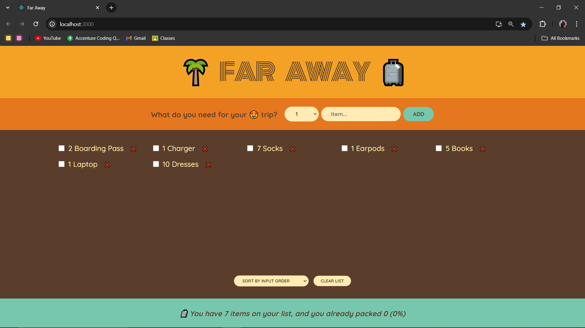
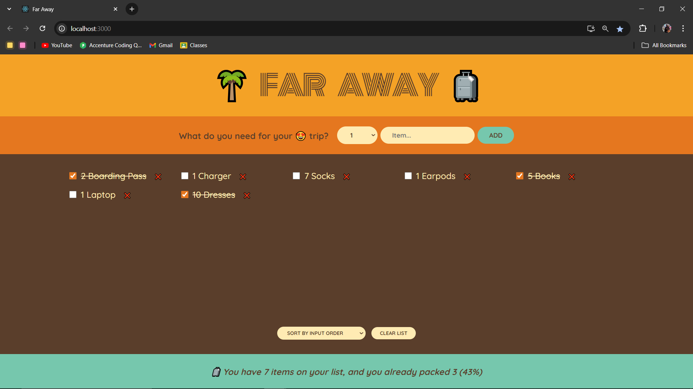
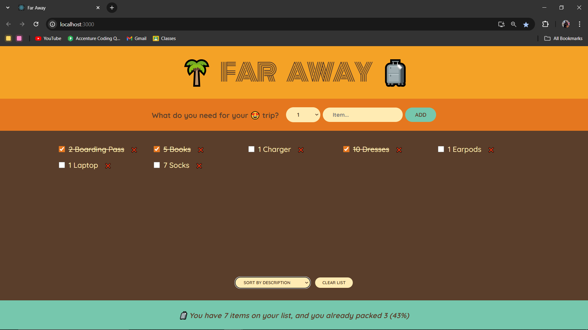
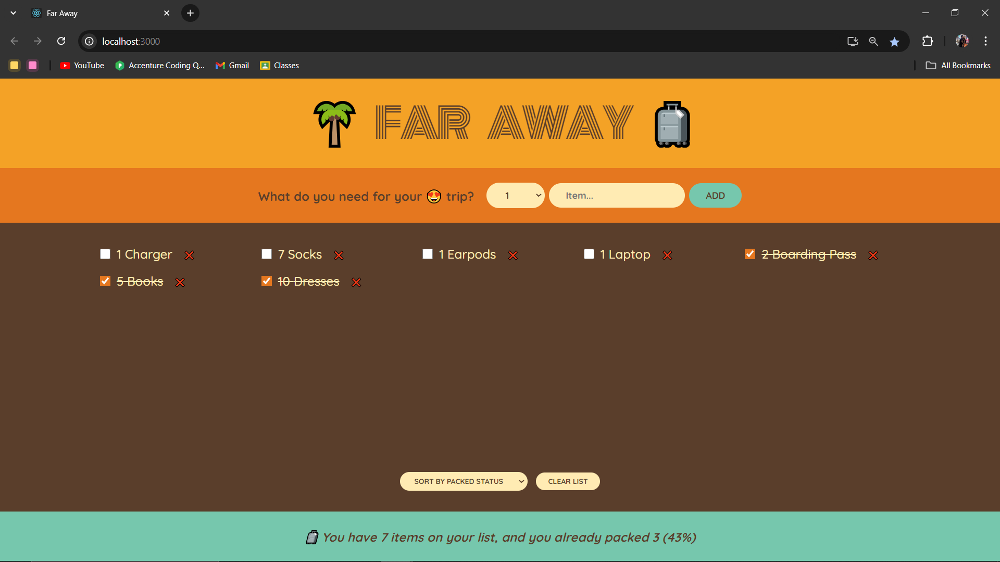
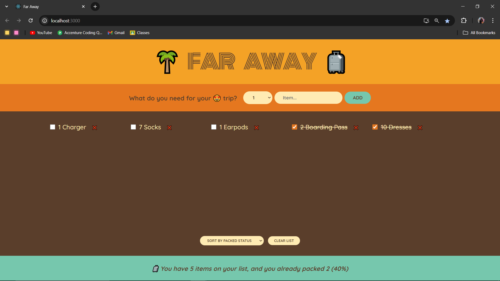
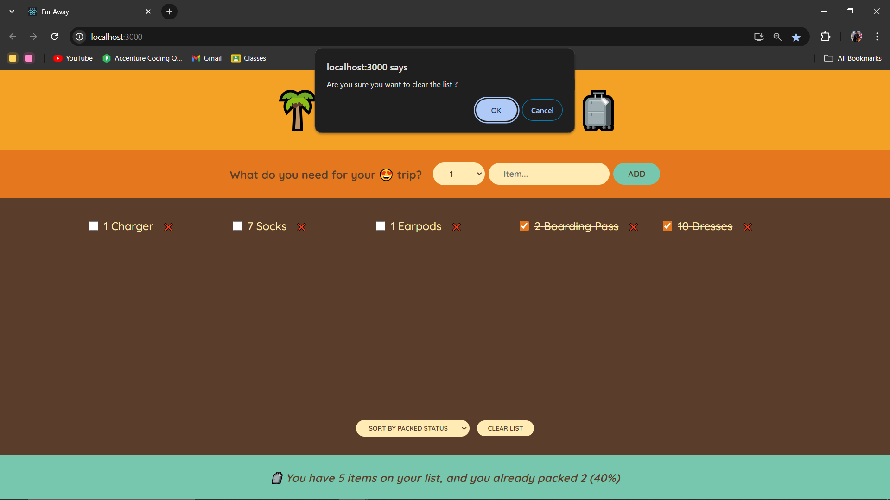

# 🌴 Far Away 🧳

Welcome to **Far Away**! 🎒 This delightful packing list app is here to make your travel prep a breeze. Whether you’re heading to a weekend getaway or a month-long adventure, this tool has you covered! 🧳

## 🌟 Features

- **Add Items** ➕: Create a list of everything you need to pack.
- **Mark as Packed** ✅: Check off items as you tuck them away.
- **Delete Items** ❌: Remove anything you no longer need.
- **Clear Entire List** 🗑️: Start fresh by clearing all items from your list at once!
- **Sort Items** 🔄: Organize your list by name, description, or packed status.
- **Packing Stats** 📊: Keep track of how many items you've packed and see your packing completion percentage!

## 📸 Screenshots

Here are some screenshots of the app in action:

*Initial look*


*Adding a new item to the packing list.*
  

*Marking items as packed.*
  

*After sorting items*
By Description


By Packed Status


*Deleting items from the list*


*Clearing the entire list)


## 🚀 My Learning Journey

Building **Far Away** has been an exciting adventure in learning React! Along the way, I’ve dived into:

- **State Management** 🛠️: Mastering the ins and outs of component states.
- **Lifting State Up** ⬆️: Sharing state seamlessly between components.
- **Derived State** 🔍: Crafting new states based on existing ones.
- **Controlled Components** 🎛️: Managing forms with finesse.

This project has not only honed my skills but also fueled my passion for coding. I can’t wait to continue my journey! 💻✨

## 📥 Installation

Want to try it out? Here’s how to get started:

1. Clone the repository:
   ```bash
   git clone https://github.com/yourusername/far-away.git
   ```
2. Navigate to the project directory:
   ```bash
   cd far-away
   ```
3. Install dependecies:
   ```bash
   npm install
   ```
4. Start the development server:
   ```bash
   npm start
   ```
   Open your browser and head to http://localhost:3000 to see the magic! 🌟
   
